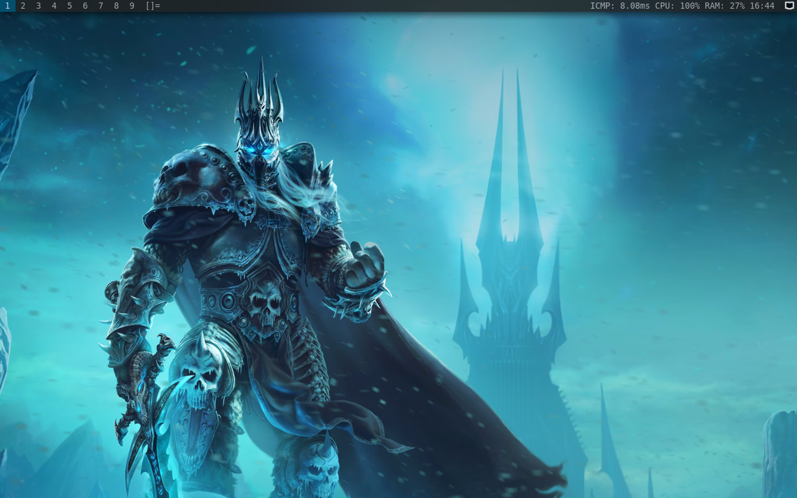

# Azure Linux WM
Installed dwm on Azure Linux. why dwm? cause this wm is so lightweight and full customize. dwm? twm? fell familiar right?

# Preview
| DWM on Azure Linux 3.0 |
|-|
|  |
| <div align="center"> - </div> |

other screenshot : [image1](image/preview-dwm.png) - [image2](image/preview-kernel-6.11.0.png) - [image3](image/preview-plymounth.png) - [image4](image/ms-edge-on-azurelinux.png)

# To Do
> Installing on bare metal later

# How To Install
This script is active maintenance 🟢
```zsh
wget https://gist.githubusercontent.com/cilegordev/18c4a83e55c9f4ff456b6c0a9658d617/raw/8a495e8ddbc3f186ba62cb2d32c6d78eb8430b7d/dwm-src-azl3.sh && chmod +x dwm-src-azl3.sh && ./dwm-src-azl3.sh
```
<details>
  <summary>
<h2>pre-installed : </h2>
</summary>
  
- dwm-6.5
- dmenu-5.3
- st-0.9.2
- slstatus-1.0
- feh-3.10.3
- compton-1.0
- plymouth-24.004.60
- thunar-4.19.3
- mousepad-0.6.2
- neofetch-7.1.1
- firefox-131.0
</details>

# How To Apply Plymounth
```zsh
sudo nano /etc/deafault/grub
GRUB_CMDLINE_LINUX_DEFAULT="quiet splash"
GRUB_DISABLE_OS_PROBER=false
sudo grub2-mkconfig -o /boot/grub2/grub.cfg
sudo plymouth-set-default-theme azure --rebuild-initrd
```
