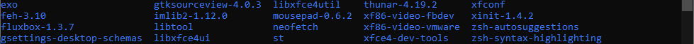

# Azure Linux WM
I installed it just because I tried it before, I installed twm on [CBL-Mariner](https://github.com/cilegordev/Azure-Linux-WM/blob/CBL-Mariner/TAKEABREAK.md), so this time I tried installing fluxbox on Azure Linux.

# Preview
| Azure Linux 3.0 |
|-|
|  |
| |

| Some Packages I Installed |
|-|
|  |
| <div align="center"> Road Map : WM --> Wallpapaer --> Browser --> Terminal </div> |

other screenshot : [image1](image/fluxbox-wm.png) - [image2](image/fluxbox-wm2.png) - [image3](image/neotop.png) - [image4](image/midori-browser.png)

# To Do
> Installing on bare metal maybe

# How To Install
⚠️ This script is not active maintenance 🟠
```zsh
wget https://gist.githubusercontent.com/cilegordev/89271da096610b593480e85c9ef318eb/raw/1533a4610b0dad7d2ab6bc0f695c9f79e1b539c9/fluxbox-src-azl3.sh && chmod +x fluxbox-src-azl3.sh && ./fluxbox-src-azl3.sh
```

# Credits
Laptop : Lenovo Ideapad 330 - Windows 10 Pro 2004 </br>
Big hug to : Ghost Spectre(Windows mod) - VMware(VM) - cmd(SSH) - WinSCP(SFTP) </br>
Special thanks to : BLFS - Gitlab - Github - Microsoft - ChatGPT - Gemini - etc </br>