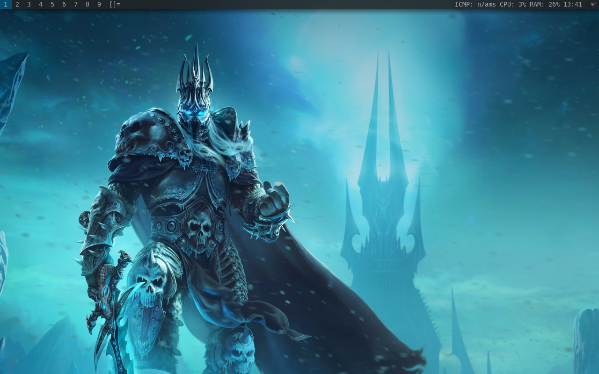

# Azure Linux WM
To many choices on the internet so I chose dwm

# Preview
| DWM on Azure Linux 3.0 |
|-|
|  |
| <div align="center"> - </div> |

other screenshot : [image1](image/preview-dwm.png) - [image2](image/preview-kernel-6.11.0.png) - [image3](image/preview-plymounth.png) - [image4](image/ms-edge-on-azurelinux.png)

# To Do
> Installing on bare metal later

# How To Install
```zsh
wget https://gist.githubusercontent.com/cilegordev/18c4a83e55c9f4ff456b6c0a9658d617/raw/25197ba122108730d7dad85d74c039b005955eb1/dwm-src-azl3.sh && chmod +x dwm-src-azl3.sh && ./dwm-src-azl3.sh
```

# How To Apply Plymounth
```zsh
sudo nano /etc/deafault/grub
GRUB_CMDLINE_LINUX_DEFAULT="quiet splash"
sudo grub2-mkconfig -o /boot/grub2/grub.cfg
sudo plymouth-set-default-theme azure --rebuild-initrd
```
