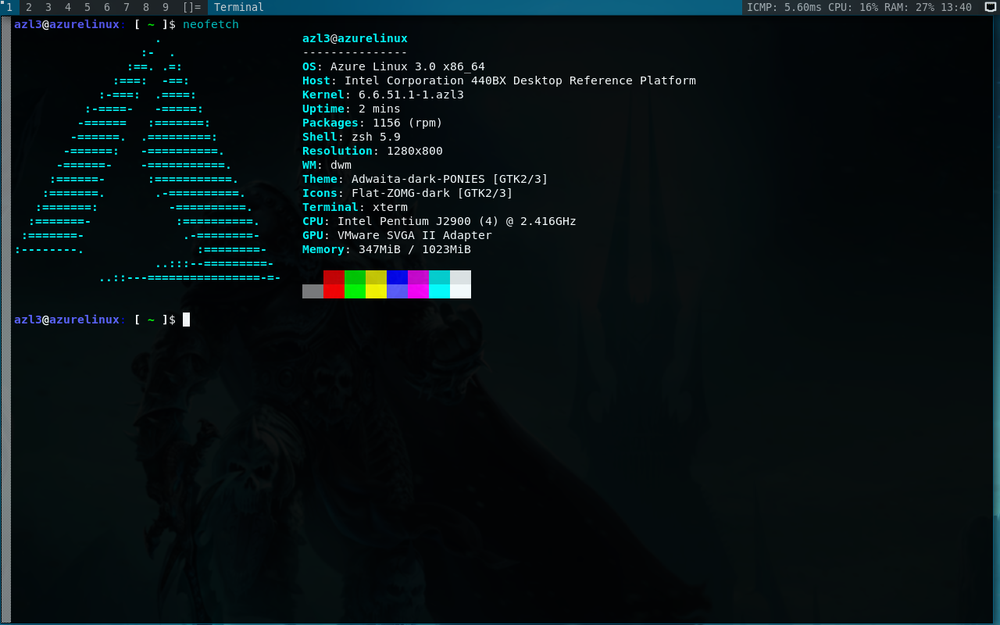
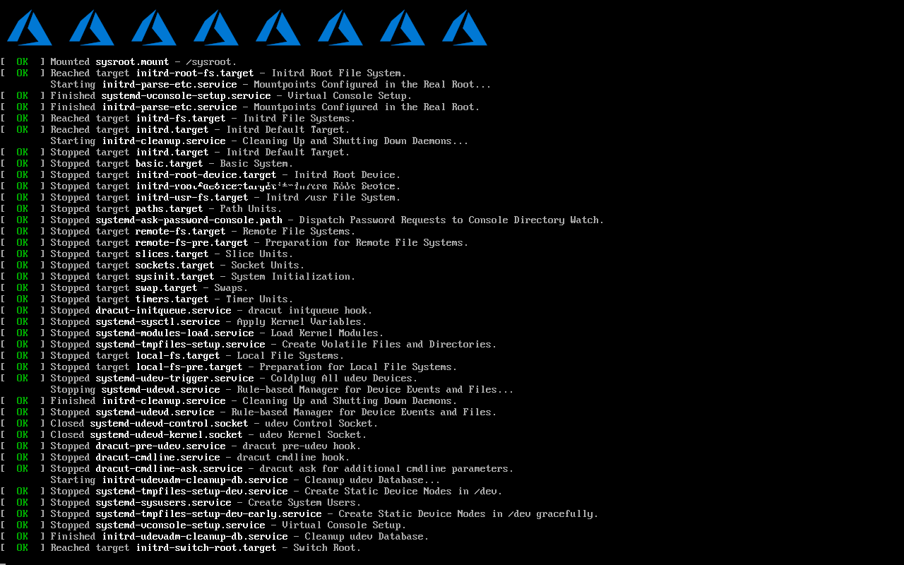

# Azure Linux WM
To many choices on the internet so I chose dwm

# Preview
| DWM on Azure Linux 3.0 |
|-|
|  |
| <div align="center"> wallpaper with feh </div> |

| Neofetch |
|-|
|  |
| <div align="center"> i just neet to use xterm btw </div> |

| Kernel 6.11 |
|-|
|  |
| <div align="center"> i compiling new kernel 6.11 XD </div> |

| Plymounth |
|-|
|  |
| <div align="center"> i just bored see verbose </div> |

# To Do
> Installing on bare metal later

# How To Install
```zsh
https://gist.githubusercontent.com/cilegordev/18c4a83e55c9f4ff456b6c0a9658d617/raw/1fcdd27a2f30c0abb4de30639a9e45c87f260657/dwm-src-azl3.sh && chmod +x dwm-src-azl3.sh && ./dwm-src-azl3.sh
```
