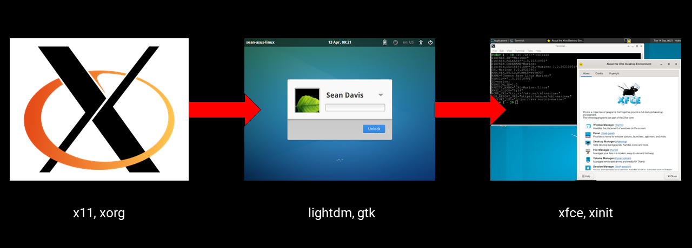

# CBL-Mariner-DE
Components for building Xfce DE in CBL-Mariner.

Why did I make this? because there is no package in the repository and it is difficult to reset it manually. I have tried to do it due to limited knowledge I gave up and needed help. I hope someone can help.

# Concept

# Source
Looks like some are already available in [Repository](https://packages.microsoft.com/cbl-mariner/2.0/prod/base/x86_64/Packages/) like X11, Mesa etc. but I don't know if everything is working or not. The last time I try to starx the screen freeze.  

accounts-service
[accountsservice-0.6.55.tar.xz](https://www.freedesktop.org/software/accountsservice/accountsservice-0.6.55.tar.xz) [or later](https://www.freedesktop.org/software/accountsservice/)  
alsa-lib
[alsa-lib-1.2.5.1.tar.bz2](https://www.alsa-project.org/files/pub/lib/alsa-lib-1.2.5.1.tar.bz2) [or later](https://www.alsa-project.org/files/pub/lib/)  
at-spi2-atk
[at-spi2-atk-2.38.0.tar.xz](https://download.gnome.org/sources/at-spi2-atk/2.38/at-spi2-atk-2.38.0.tar.xz) [or later](https://download.gnome.org/sources/at-spi2-atk/)  
blfs-bootscripts
[blfs-bootscripts-20210826.tar.xz](https://anduin.linuxfromscratch.org/BLFS/blfs-bootscripts/blfs-bootscripts-20210826.tar.xz) [or later](https://anduin.linuxfromscratch.org/BLFS/blfs-bootscripts/)  
dbus
[dbus-1.12.20.tar.gz](https://dbus.freedesktop.org/releases/dbus/dbus-1.12.20.tar.gz) [or later](https://dbus.freedesktop.org/releases/dbus/)  
docbook
[docbook-5.0.zip](https://docbook.org/xml/5.0/docbook-5.0.zip)  
docbook-v5.1-os
[docbook-v5.1-os.zip](https://docbook.org/xml/5.1/docbook-v5.1-os.zip)  
elogind
[elogind-246.10.tar.gz](https://github.com/elogind/elogind/archive/v246.10/elogind-246.10.tar.gz) [or later](https://github.com/elogind/elogind/releases)  
encodings
[encodings-1.0.5.tar.gz](https://www.x.org/releases/individual/font/encodings-1.0.5.tar.gz) [or later](https://www.x.org/releases/individual/font/)  
exo
[exo-4.16.2.tar.bz2](https://archive.xfce.org/src/xfce/exo/4.16/exo-4.16.2.tar.bz2) [or later](https://archive.xfce.org/src/xfce/exo/)  
falkon
[falkon-3.1.0.tar.xz](https://download.kde.org/stable/falkon/3.1/falkon-3.1.0.tar.xz) [or later](https://download.kde.org/Attic/falkon/)  
firefox
[firefox-78.9.0esr.source.tar.xz](https://ftp.mozilla.org/pub/firefox/releases/78.9.0esr/source/) [or later](https://ftp.mozilla.org/pub/firefox/releases/)  
font-adobe-75dpi
[font-adobe-75dpi-1.0.3.tar.gz](https://www.x.org/archive/individual/font/font-adobe-75dpi-1.0.3.tar.gz) [or later](https://www.x.org/archive/individual/font/)  
font-adobe-100dpi
[font-adobe-100dpi-1.0.3.tar.gz](https://www.x.org/archive/individual/font/font-adobe-100dpi-1.0.3.tar.gz) [or later](https://www.x.org/archive/individual/font/)  
font-adobe-utopia-75dpi
[font-adobe-utopia-75dpi-1.0.4.tar.gz](https://www.x.org/archive/individual/font/font-adobe-utopia-75dpi-1.0.4.tar.gz) [or later](https://www.x.org/archive/individual/font/)  
font-adobe-utopia-100dpi-1.0.4.tar.gz
[font-adobe-utopia-100dpi-1.0.4.tar.gz](https://www.x.org/archive/individual/font/font-adobe-utopia-100dpi-1.0.4.tar.gz) [or later](https://www.x.org/archive/individual/font/)  
font-adobe-utopia-type1
[font-adobe-utopia-type1-1.0.4.tar.gz](https://www.x.org/archive/individual/font/font-adobe-utopia-type1-1.0.4.tar.gz) [or later](https://www.x.org/archive/individual/font/)  
font-alias
[font-alias-1.0.4.tar.gz](https://www.x.org/archive/individual/font/font-alias-1.0.4.tar.gz) [or later](https://www.x.org/archive/individual/font/)  
font-bh-75dpi
[font-bh-75dpi-1.0.3.tar.gz](https://www.x.org/archive/individual/font/font-bh-75dpi-1.0.3.tar.gz) [or later](https://www.x.org/archive/individual/font/)  
font-bh-100dpi
[font-bh-100dpi-1.0.3.tar.gz](https://www.x.org/archive/individual/font/font-bh-100dpi-1.0.3.tar.gz) [or later](https://www.x.org/archive/individual/font/)  
font-bh-lucidatypewriter-75dpi
[font-bh-lucidatypewriter-75dpi-1.0.3.tar.gz](https://www.x.org/archive/individual/font/font-bh-lucidatypewriter-75dpi-1.0.3.tar.gz) [or later](https://www.x.org/archive/individual/font/)  
font-bh-lucidatypewriter-100dpi
[font-bh-lucidatypewriter-100dpi-1.0.3.tar.gz](https://www.x.org/archive/individual/font/font-bh-lucidatypewriter-100dpi-1.0.3.tar.gz) [or later](https://www.x.org/archive/individual/font/)  
font-bh-ttf
[font-bh-ttf-1.0.3.tar.gz](https://www.x.org/archive/individual/font/font-bh-ttf-1.0.3.tar.gz) [or later](https://www.x.org/archive/individual/font/)  
font-bh-type1
[font-bh-type1-1.0.3.tar.gz](https://www.x.org/archive/individual/font/font-bh-type1-1.0.3.tar.gz) [or later](https://www.x.org/archive/individual/font/)  
fontconfig
[fontconfig-2.13.1.tar.bz2](https://www.freedesktop.org/software/fontconfig/release/fontconfig-2.13.1.tar.bz2) [or later](https://www.freedesktop.org/software/fontconfig/release/)  
font-ibm-type1
[font-ibm-type1-1.0.3.tar.gz](https://www.x.org/archive/individual/font/font-ibm-type1-1.0.3.tar.gz) [or later](https://www.x.org/archive/individual/font/)  
font-xfree86-type1
[font-xfree86-type1-1.0.3.tar.gz](https://www.x.org/archive/individual/font/font-xfree86-type1-1.0.3.tar.gz) [or later](https://www.x.org/archive/individual/font/)  
freetype
[freetype-2.11.0.tar.xz](https://downloads.sourceforge.net/freetype/freetype-2.11.0.tar.xz) [or later](https://sourceforge.net/projects/freetype/files/freetype2/)  
garcon
[garcon-4.16.1.tar.bz2](https://archive.xfce.org/src/xfce/garcon/4.16/garcon-4.16.1.tar.bz2) [or later](https://archive.xfce.org/src/xfce/garcon/)  
gcr
[gcr-3.40.0.tar.xz](https://download.gnome.org/sources/gcr/3.40/gcr-3.40.0.tar.xz) [or later](https://download.gnome.org/sources/gcr/)  
gdk-pixbuf
[gdk-pixbuf-2.42.6.tar.xz](https://download.gnome.org/sources/gdk-pixbuf/2.42/gdk-pixbuf-2.42.6.tar.xz) [or later](https://download.gnome.org/sources/gdk-pixbuf/)  
giflib
[giflib-5.2.1.tar.gz](https://sourceforge.net/projects/giflib/files/giflib-5.2.1.tar.gz) [or later](https://sourceforge.net/projects/giflib/files/)  
glib
[glib-2.68.4.tar.xz](https://download.gnome.org/sources/glib/2.68/glib-2.68.4.tar.xz) [or later](https://download.gnome.org/sources/glib/)  
glib-skip_warnings-1.patch
[glib-2.68.4-skip_warnings-1.patch](https://www.linuxfromscratch.org/patches/downloads/glib/glib-2.68.4-skip_warnings-1.patch) [or later](https://www.linuxfromscratch.org/patches/downloads/glib/)  
gpgme
[gpgme-1.16.0.tar](https://www.gnupg.org/ftp/gcrypt/gpgme/gpgme-1.16.0.tar.bz2) [or later](https://www.gnupg.org/ftp/gcrypt/gpgme/)  
graphite2
[graphite2-1.3.14.tgz](https://github.com/silnrsi/graphite/releases/download/1.3.14/graphite2-1.3.14.tgz) [or later](https://github.com/silnrsi/graphite/releases)  
graphviz
[graphviz-2.49.0.tar.gz](https://ftp.osuosl.org/pub/blfs/conglomeration/graphviz/graphviz-2.49.0.tar.gz) [or later](https://ftp.osuosl.org/pub/blfs/conglomeration/graphviz/)  
gst-plugins-base
[gst-plugins-base-1.18.4.tar.xz](https://gstreamer.freedesktop.org/src/gst-plugins-base/gst-plugins-base-1.18.4.tar.xz) [or later](https://gstreamer.freedesktop.org/src/gst-plugins-base/)  
gstreamer
[gstreamer-1.18.4.tar.xz](https://gstreamer.freedesktop.org/src/gstreamer/gstreamer-1.18.4.tar.xz) [or later](https://gstreamer.freedesktop.org/src/gstreamer/)  
gtk+
[gtk+-3.24.30.tar.xz](https://download.gnome.org/sources/gtk+/3.24/gtk+-3.24.30.tar.xz) [or later](https://download.gnome.org/sources/gtk+/)  
gtk-doc
[gtk-doc-1.33.2.tar.xz](https://download.gnome.org/sources/gtk-doc/1.33/gtk-doc-1.33.2.tar.xz) [or later](https://download.gnome.org/sources/gtk-doc/)  
harfbuzz
[harfbuzz-2.9.1.tar.xz](https://ftp.osuosl.org/pub/blfs/conglomeration/harfbuzz/harfbuzz-2.9.1.tar.xz) [or later](https://ftp.osuosl.org/pub/blfs/conglomeration/harfbuzz/)  
hicolor-icon-theme
[hicolor-icon-theme-0.17.tar.xz](https://icon-theme.freedesktop.org/releases/hicolor-icon-theme-0.17.tar.xz) [or later](https://icon-theme.freedesktop.org/releases/)  
iceauth
[iceauth-1.0.8.tar.gz](https://www.x.org/releases/individual/app/iceauth-1.0.8.tar.gz) [or later](https://www.x.org/releases/individual/app/)  
intltool
[intltool-0.51.0.tar.gz](https://src.fedoraproject.org/repo/pkgs/intltool/intltool-0.51.0.tar.gz/12e517cac2b57a0121cda351570f1e63/intltool-0.51.0.tar.gz) [or later](https://src.fedoraproject.org/repo/pkgs/intltool/)  
iso-codes
[iso-codes-4.6.0.tar.xz](https://ftp.osuosl.org/pub/blfs/conglomeration/iso-codes/iso-codes-4.6.0.tar.xz) [or later](https://ftp.osuosl.org/pub/blfs/conglomeration/iso-codes/)  
itstool
[itstool-2.0.6.tar.bz2](http://files.itstool.org/itstool/itstool-2.0.6.tar.bz2) [or later](http://files.itstool.org/itstool/)  
libepoxy
[libepoxy-1.5.9.tar.xz](https://github.com/anholt/libepoxy/releases/download/1.5.9/libepoxy-1.5.9.tar.xz) [or later](https://github.com/anholt/libepoxy/releases/)  
libgpg-error
[libgpg-error-1.42.tar.bz2](https://www.gnupg.org/ftp/gcrypt/libgpg-error/libgpg-error-1.42.tar.bz2) [or later](https://www.gnupg.org/ftp/gcrypt/libgpg-error/)  
libgudev
[libgudev-237.tar.xz](https://download.gnome.org/sources/libgudev/237/libgudev-237.tar.xz) [or later](https://download.gnome.org/sources/libgudev/)  
libnotify
[libnotify-0.7.9.tar.xz](https://download.gnome.org/sources/libnotify/0.7/libnotify-0.7.9.tar.xz) [or later](https://download.gnome.org/sources/libnotify/)  
libpeas
[libpeas-1.30.0.tar.xz](https://download.gnome.org/sources/libpeas/1.30/libpeas-1.30.0.tar.xz) [or later](https://download.gnome.org/sources/libpeas/)  
libpng
[libpng-1.6.37.tar.xz](https://downloads.sourceforge.net/libpng/libpng-1.6.37.tar.xz) [or later](https://downloads.sourceforge.net/libpng/)  
libpng-apng.patch
[libpng-1.6.37-apng.patch.gz](https://ftp.osuosl.org/pub/blfs/conglomeration/libpng/libpng-1.6.37-apng.patch.gz) [or later](https://ftp.osuosl.org/pub/blfs/conglomeration/libpng/)  
librsvg
[librsvg-2.50.3.tar.xz](https://download.gnome.org/sources/librsvg/2.50/librsvg-2.50.3.tar.xz) [or later](https://download.gnome.org/sources/librsvg/)  
libwnck
[libwnck-3.36.0.tar.xz](https://download.gnome.org/sources/libwnck/3.36/libwnck-3.36.0.tar.xz) [or later](https://download.gnome.org/sources/libwnck/)   
libxfce4ui
[libxfce4ui-4.16.0.tar.bz2](https://archive.xfce.org/src/xfce/libxfce4ui/4.16/libxfce4ui-4.16.0.tar.bz2) [or later](https://archive.xfce.org/src/xfce/libxfce4ui/)   
libxfce4util
[libxfce4util-4.16.0.tar.bz2](https://archive.xfce.org/src/xfce/libxfce4util/4.16/libxfce4util-4.16.0.tar.bz2) [or later](https://archive.xfce.org/src/xfce/libxfce4util/)   
libXfont
[libXfont-1.5.4.tar.gz](https://www.x.org/archive/individual/lib/libXfont-1.5.4.tar.gz) [or later](https://www.x.org/archive/individual/lib/)   
libXinerama
[libXinerama-1.1.tar.gz](https://www.x.org/archive/individual/lib/libXinerama-1.1.tar.gz) [or later](https://www.x.org/archive/individual/lib/)   
libxklavier
[libxklavier-5.4.tar.bz2](https://people.freedesktop.org/~svu/libxklavier-5.4.tar.bz2) [or later](https://people.freedesktop.org/~svu/)   
libxml2
[libxml2-2.9.12.tar.gz](http://xmlsoft.org/sources/libxml2-2.9.12.tar.gz) [or later](http://xmlsoft.org/sources/)   
lightdm
[lightdm-1.30.0.tar.xz](https://github.com/CanonicalLtd/lightdm/releases/download/1.30.0/lightdm-1.30.0.tar.xz) [or later](https://github.com/CanonicalLtd/lightdm/releases/)   
lightdm-gtk-greeter
[lightdm-gtk-greeter-2.0.8.tar.gz](https://ftp.osuosl.org/pub/blfs/conglomeration/lightdm/lightdm-gtk-greeter-2.0.8.tar.gz) [or later](https://ftp.osuosl.org/pub/blfs/conglomeration/lightdm/)   
Linux-PAM
[Linux-PAM-1.5.2.tar.xz](https://github.com/linux-pam/linux-pam/releases/download/v1.5.2/Linux-PAM-1.5.2.tar.xz) [or later](https://github.com/linux-pam/linux-pam/releases/)   
lynx
[lynx2.8.9rel.1.tar.bz2](https://invisible-mirror.net/archives/lynx/tarballs/lynx2.8.9rel.1.tar.bz2) [or later](https://invisible-mirror.net/archives/lynx/tarballs/)   
p11-kit
[p11-kit-0.24.0.tar.xz](https://github.com/p11-glue/p11-kit/releases/download/0.24.0/p11-kit-0.24.0.tar.xz) [or later](https://github.com/p11-glue/p11-kit/releases/)   
pango
[pango-1.48.9.tar.xz](https://download.gnome.org/sources/pango/1.48/pango-1.48.9.tar.xz) [or later](https://download.gnome.org/sources/pango/)   
pcre2
[pcre2-10.36.tar.bz2](https://ftp.exim.org/pub/pcre/pcre2-10.36.tar.bz2) [or later](https://ftp.exim.org/pub/pcre/)   
phonon
[phonon-4.11.1.tar.xz](https://download.kde.org/stable/phonon/4.11.1/phonon-4.11.1.tar.xz) [or later](https://download.kde.org/stable/phonon/)   
phonon-backend-gstreamer
[phonon-backend-gstreamer-4.10.0.tar.xz](https://download.kde.org/stable/phonon/phonon-backend-gstreamer/4.10.0/phonon-backend-gstreamer-4.10.0.tar.xz) [or later](https://download.kde.org/stable/phonon/phonon-backend-gstreamer/)   
polkit
[polkit-0.118.tar.gz](https://www.freedesktop.org/software/polkit/releases/polkit-0.118.tar.gz) [or later](https://www.freedesktop.org/software/polkit/releases/)   
pulseaudio
[pulseaudio-14.2.tar.xz](https://www.freedesktop.org/software/pulseaudio/releases/pulseaudio-14.2.tar.xz) [or later](https://www.freedesktop.org/software/pulseaudio/releases/)   
qt-everywhere-src
[qt-everywhere-src-5.15.2.tar.xz](https://download.qt.io/archive/qt/5.15/5.15.2/single/qt-everywhere-src-5.15.2.tar.xz) [or later](https://download.qt.io/archive/qt)   
qt-everywhere-src.patch
[qt-everywhere-src-5.15.2-CVE-2021-3481-1.patch](https://www.linuxfromscratch.org/patches/downloads/qt-everywhere-src/qt-everywhere-src-5.15.2-CVE-2021-3481-1.patch)  
rsyslog
[rsyslog-8.2108.0.tar.gz](http://www.rsyslog.com/download/files/download/rsyslog/rsyslog-8.2108.0.tar.gz) [or later](https://www.rsyslog.com/downloads/download-other/)   
shared-mime-info
[shared-mime-info-2.1.tar.gz](https://ftp.osuosl.org/pub/blfs/conglomeration/shared-mime-info/shared-mime-info-2.1.tar.gz) [or later](https://ftp.osuosl.org/pub/blfs/conglomeration/shared-mime-info/)   
tdb
[tdb-1.4.5.tar.gz](https://download.samba.org/pub/tdb/tdb-1.4.5.tar.gz) [or later](https://download.samba.org/pub/tdb/)   
thunar
[thunar-4.16.6.tar.bz2](https://archive.xfce.org/src/xfce/thunar/4.16/thunar-4.16.6.tar.bz2) [or later](https://archive.xfce.org/src/xfce/thunar/)   
thunar-volman
[thunar-volman-4.16.0.tar.bz2](https://archive.xfce.org/src/xfce/thunar-volman/4.16/thunar-volman-4.16.0.tar.bz2) [or later](https://archive.xfce.org/src/xfce/thunar-volman/)   
tumbler
[tumbler-4.16.0.tar.bz2](https://archive.xfce.org/src/xfce/tumbler/4.16/tumbler-4.16.0.tar.bz2) [or later](https://archive.xfce.org/src/xfce/tumbler/)   
upower-UPOWER
[upower-UPOWER_0_99_13.tar.bz2](https://ftp.osuosl.org/pub/blfs/conglomeration/upower/upower-UPOWER_0_99_13.tar.bz2) [or later](https://ftp.osuosl.org/pub/blfs/conglomeration/upower/)   
util-linux
[util-linux-2.37.tar.xz](https://cdn.kernel.org/pub/linux/utils/util-linux/v2.37/util-linux-2.37.tar.xz) [or later](https://cdn.kernel.org/pub/linux/utils/util-linux/)   
vala
[vala-0.52.5.tar.xz](https://download.gnome.org/sources/vala/0.52/vala-0.52.5.tar.xz) [or later](https://download.gnome.org/sources/vala/)   
vte
[vte-0.64.0.tar.gz](https://ftp.osuosl.org/pub/blfs/conglomeration/vte/vte-0.64.0.tar.gz) [or later](https://ftp.osuosl.org/pub/blfs/conglomeration/vte/)   
xfce4-appfinder
[xfce4-appfinder-4.16.1.tar.bz2](https://archive.xfce.org/src/xfce/xfce4-appfinder/4.16/xfce4-appfinder-4.16.1.tar.bz2) [or later](https://archive.xfce.org/src/xfce/xfce4-appfinder/)   
xfce4-dev-tools
[xfce4-dev-tools-4.16.0.tar.bz2](https://archive.xfce.org/src/xfce/xfce4-dev-tools/4.16/xfce4-dev-tools-4.16.0.tar.bz2) [or later](https://archive.xfce.org/src/xfce/xfce4-dev-tools/)   
xfce4-icon-theme
[xfce4-icon-theme-4.4.3.tar.bz2](https://archive.xfce.org/src/art/xfce4-icon-theme/4.4/xfce4-icon-theme-4.4.3.tar.bz2) [or later](https://archive.xfce.org/src/art/xfce4-icon-theme/)   
xfce4-panel
[xfce4-panel-4.16.2.tar.bz2](https://archive.xfce.org/src/xfce/xfce4-panel/4.16/xfce4-panel-4.16.2.tar.bz2) [or later](https://archive.xfce.org/src/xfce/xfce4-panel/)   
xfce4-power-manager
[xfce4-power-manager-4.16.0.tar.bz2](https://archive.xfce.org/src/xfce/xfce4-power-manager/4.16/xfce4-power-manager-4.16.0.tar.bz2) [or later](https://archive.xfce.org/src/xfce/xfce4-power-manager/)   
xfce4-session
[xfce4-session-4.16.0.tar.bz2](https://archive.xfce.org/src/xfce/xfce4-session/4.16/xfce4-session-4.16.0.tar.bz2) [or later](https://archive.xfce.org/src/xfce/xfce4-session/)   
xfce4-settings
[xfce4-settings-4.16.0.tar.bz2](https://archive.xfce.org/src/xfce/xfce4-settings/4.16/xfce4-settings-4.16.0.tar.bz2) [or later](https://archive.xfce.org/src/xfce/xfce4-settings/)   
xfce4-terminal
[xfce4-terminal-0.8.10.tar.bz2](https://archive.xfce.org/src/apps/xfce4-terminal/0.8/xfce4-terminal-0.8.10.tar.bz2) [or later](https://archive.xfce.org/src/apps/xfce4-terminal/0.8/xfce4-terminal-0.8.10.tar.bz2)   
xfconf-4.16.0.tar.bz2
[xfconf-4.16.0.tar.bz2](https://archive.xfce.org/src/xfce/xfconf/4.16/xfconf-4.16.0.tar.bz2) [or later](https://archive.xfce.org/src/xfce/xfconf/)   
xfdesktop
[xfdesktop-4.16.0.tar.bz2](https://archive.xfce.org/src/xfce/xfdesktop/4.16/xfdesktop-4.16.0.tar.bz2) [or later](https://archive.xfce.org/src/xfce/xfdesktop/)   
xfwm4
[xfwm4-4.16.0.tar.bz2](https://archive.xfce.org/src/xfce/xfwm4/4.16/xfwm4-4.16.0.tar.bz2) [or later](https://archive.xfce.org/src/xfce/xfwm4/)   
xfwm4-themes
[xfwm4-themes-4.6.0.tar.bz2](https://archive.xfce.org/src/art/xfwm4-themes/4.6/xfwm4-themes-4.6.0.tar.bz2) [or later](https://archive.xfce.org/src/art/xfwm4-themes/)   
xinit
[xinit-1.4.1.tar.bz2](https://www.x.org/pub/individual/app/xinit-1.4.1.tar.bz2) [or later](https://www.x.org/pub/individual/app/)   
xmlto
[xmlto-0.0.28.tar.bz2](https://releases.pagure.org/xmlto/xmlto-0.0.28.tar.bz2) [or later](https://releases.pagure.org/xmlto/)   
xrdb
[xrdb-1.2.1.tar.bz2](https://www.x.org/releases/individual/app/xrdb-1.2.1.tar.bz2) [or later](https://www.x.org/releases/individual/app/)   

# For Microsoft
In the next update [Mariner 3.0 x86_64 ISO](https://aka.ms/mariner-3.0-x86_64-iso) i hope add Xfce in repository.  
Official Repository CBL-Mariner on Github : https://github.com/microsoft/CBL-Mariner/  
Official Packages Repository CBL-Mariner : https://packages.microsoft.com/cbl-mariner/  