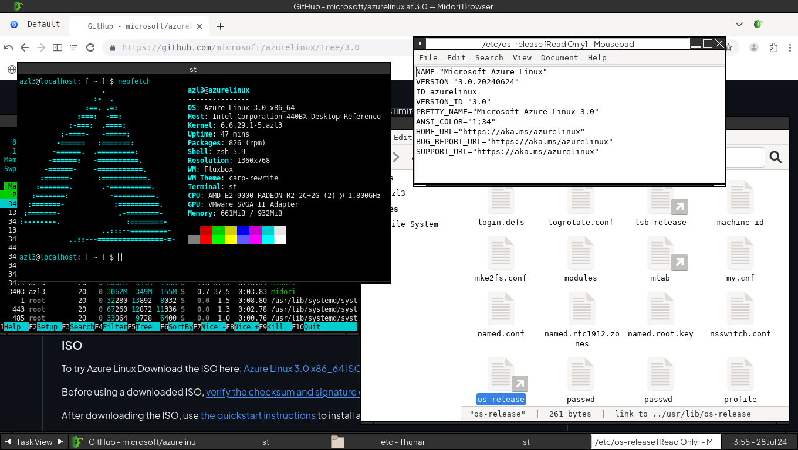
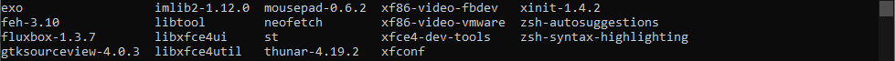

# Azure Linux WM
I installed it just because I tried it before, I installed twm on [CBL-Mariner](https://github.com/cilegordev/Azure-Linux-WM/blob/CBL-Mariner/src/configure-x11-and-twm.md), so this time I tried installing fluxbox on Azure Linux.

# Preview
| Azure Linux 3.0 |
|-|
|  |
| |

| Some Packages I Installed |
|-|
|  |
| 
 Road Map : WM --> Wallpapaer --> Browser --> Terminal 
 |

other screenshot : [image1](image/fluxbox-wm.png) - [image2](image/neotop.png) - [image3](image/xfce4.png) - [image4](image/midori-browser.png)

# To Do
> Installing LXQt DE

# Credits
Laptop : Lenovo Ideapad 330 - Windows 10 Pro 2004  
Big hug to : Ghost Spectre(Windows mod) - VMware(VM) - cmd(SSH) - WinSCP(SFTP)  
Special thanks to : BLFS - Gitlab - Github - Microsoft - ChatGPT - Gemini - etc  
