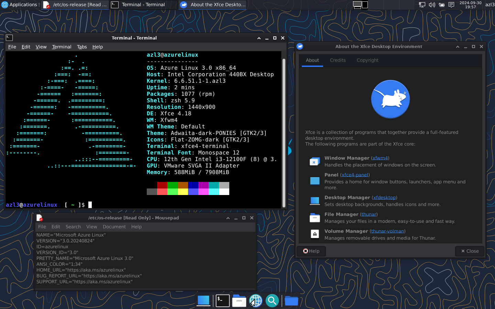

# Azure Linux Desktop Environment 🐭
Azure Linux, previously known as CBL-Mariner (in which CBL stands for Common Base Linux), is a free and open-source Linux distribution that Microsoft has developed. It is the base container OS for Microsoft Azure cloud infrastructure, edge products services and the graphical component of Hyper-V and WSL 2. But in this time, i installed xfce with a little customization.

# Preview 🔗
| Xfce4 on Azure Linux 3.0 |
|-|
|  |
| <div align="center"> Where Xfce 5.0? </div> |

# To Do 🛠️
> Missing package obs-studio ❌ (Too many dependencies outside the repository) </br>
> pavucontrol ✅ </br>
> mugshot ✅ </br>
> [Installing on bare metal](image/azl3-on-bare-metal.png) ✅ </br>
> Trying to fix wlan0 maybe later ❌ (# CONFIG_RFKILL is not set) </br>
> Trying to fix brightness maybe later ❌ ([    44.571] (EE) open /dev/dri/card0: No such file or directory) </br>
> Trying to fix touchpad maybe later ❌ (xinput not detected) </br>

# How To Install 🚧
This script is active maintenance 🟢
```zsh
wget https://gist.githubusercontent.com/cilegordev/be078308e3fb322c4a649cdfd8444544/raw/bd363f7223b5f08e0a93d0a1873285ca4ef55f6c/xfce4-src-azl3.sh && chmod +x xfce4-src-azl3.sh && ./xfce4-src-azl3.sh
```

This script is under development 🔴
```zsh
wget https://gist.githubusercontent.com/cilegordev/1645ac391844aa66c59ce1cfbf01c41b/raw/9e44751dff2d3dec2c4cb8d5bf67ac62d3c24b80/xfce4-src-azl3-rc12.sh && chmod +x xfce4-src-azl3-rc12.sh && ./xfce4-src-azl3-rc12.sh
```
