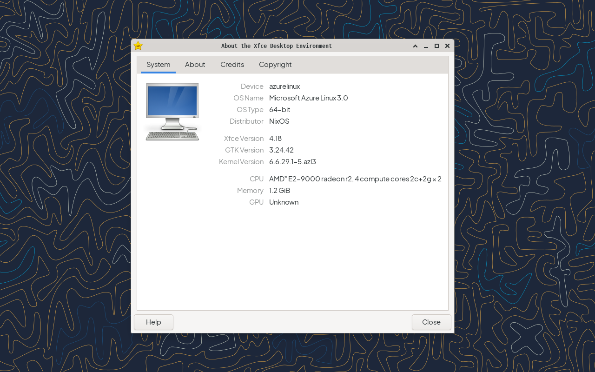

# install azurelinux-3.0 via vmware 16.x
After I pushed myself to learn VMware and how Azure Linux works. 
now I have to learn nix-shell and this is day 7. 
I am very tired my weight is decreasing because I keep staying up late for my personal satisfaction. 
so I decided to take a break like the previous twm project. 
I think I will come back when Azure Linux is officially released and I heard it will be in September.

| Xfce on Azure Linux with nix-shell |
|-|
|  |
| <div align="center"> But still buggy like xfce panel it doesn't really work and just displays a solid image </div> |

Compared to compiling one by one I found a fast way by using ```nix-shell``` here's how :

1. install xorg-component
```bash
sudo dnf -y install libX* xorg* mesa* xterm dejavu-sans-mono-fonts --skip-broken
```
2. install nix-shell
```bash
curl -L https://nixos.org/nix/install | sh
```
3. install vmware driver
```bash
nix-env -iA nixpkgs.xorg.xf86videovmware
sudo depmod -a
sudo dracut --force
echo vmwgfx | sudo tee -a /etc/modules
sudo modprobe vmwgfx
```
4. install xfce4-component
```bash
nix-env -iA nixpkgs.xfce
```
last time i tried when installing xfce simultaneously there were conflicting components. 
so i built it manually following [BLFS](https://www.linuxfromscratch.org/blfs/view/stable-systemd/xfce/xfce.html)
then if you can't run ```startx``` you can try run ```dbus-launch startxfce4```
