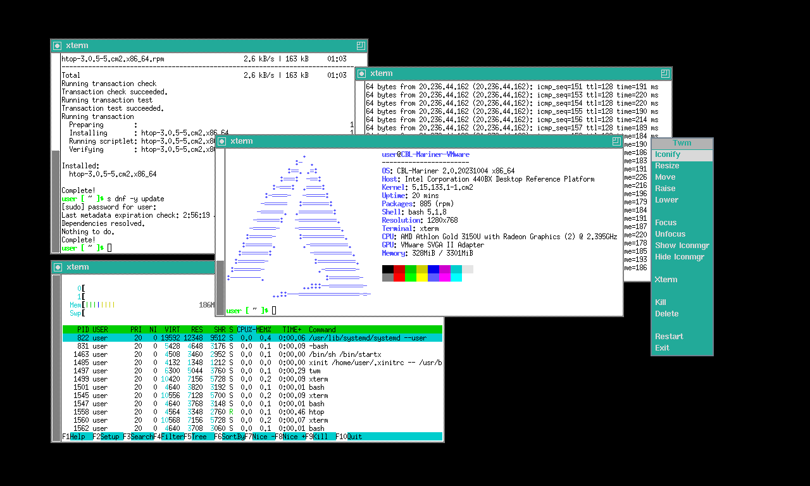

# install cbl-mariner-2.0 via vmware 16.x
source : https://raw.githubusercontent.com/DrewNaylor/drewnaylor.github.io/master/pages/wip/install-and-configure-x11-and-twm_cbl-mariner.txt
##

| TWM on CBL-Mariner |
|-|
|  |

Use SSH to make copy paste faster :

1. install xorg-component
```bash
sudo dnf -y install libX* xorg* mesa* xterm dejavu-sans-mono-fonts --skip-broken
```

2. install vmware driver
```bash
wget https://www.x.org/archive//individual/driver/xf86-video-vmware-13.4.0.tar.gz
tar -xf xf86-video-vmware-13.4.0.tar.gz
cd xf86-video-vmware-13.4.0
chmod 755 configure
./configure
sudo make install
sudo depmod -a
sudo dracut --force
echo vmwgfx | sudo tee -a /etc/modules
sudo modprobe vmwgfx
```

3. install twm
```bash
wget https://www.x.org/archive/individual/app/twm-1.0.12.tar.gz
tar -xf twm-1.0.12.tar.gz
cd twm-1.0.12
sed -i -e '/^rcdir =/s,^\(rcdir = \).*,\1/etc/X11/app-defaults,' src/Makefile.in
chmod 755 configure
./configure
sudo make install
```

4. turn on startx
```bash
nano ~/.xinitrc
#!/bin/sh
exec twm
```

5. on twm
```bash
xrandr --output Virtual-1 --mode 1360x768
```